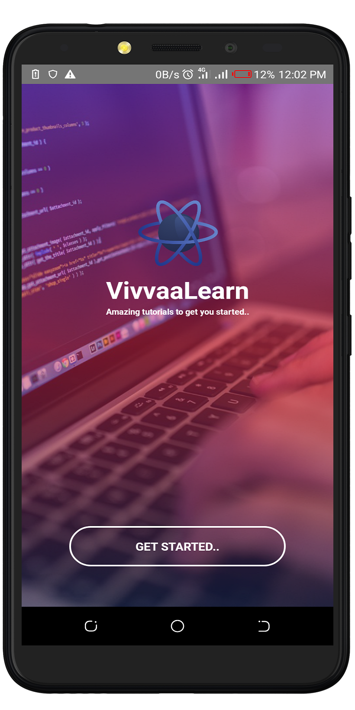
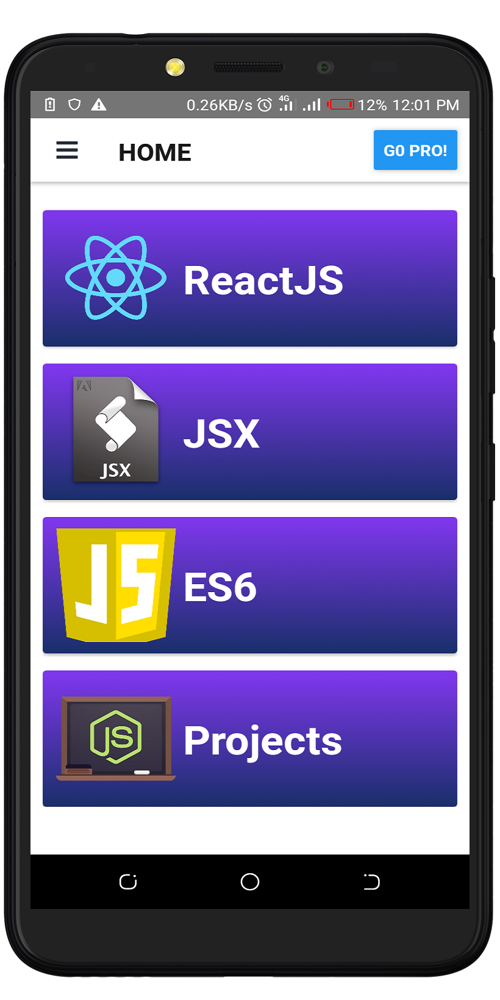
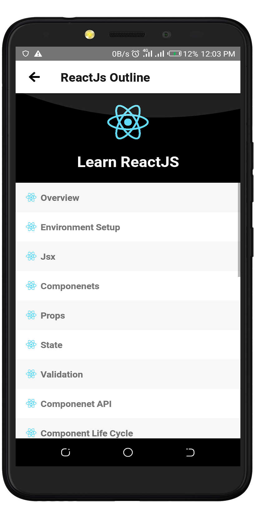

# Vivvaa React Tutorial App       []

Vivvaa React Tutorial App is a cool tutorial application on React, JSX and ES6 new features.
This application takes you from the fundermentals of this technologies giving you a smooth landing.

The app was built on **React Native**. and contains tutorials on:

* React
* JSX
* ES6

> The final apk can be downloaded here : <https://play.google.com/store/apps/details?id=com.reacttutorials>

> The Balsamiq Mockup can be downloaded here : <insert link>

## Prerequisites
You will need the following to run this project:
1. A laptop or desktop machine with internet access
2. Android Studio 3.1 Stable Channel (Latest Stable Release)
3. React Native Configured and Working on your system

## Setting Up
* Clone the Repository from Github
* Open the project folder using any editor of choice
* Run the command `npm install`
* Start the project using the command `react-native run-android` for Andriod Devices
* Start the project with the command `react-native run-ios` for IOS Devices

### The App Layout Page
This application has a simple layout, with an attractive and awesome interface as shown:

### Updates and Collaboration
* This application is still been maintained
* Feel free to fork, and contribute to this project

